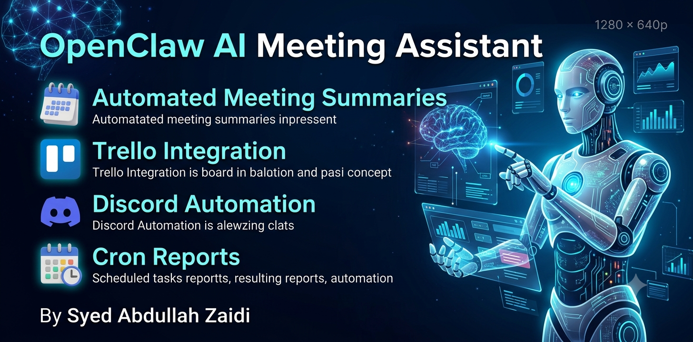
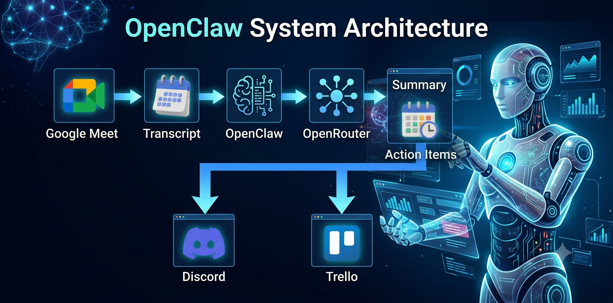
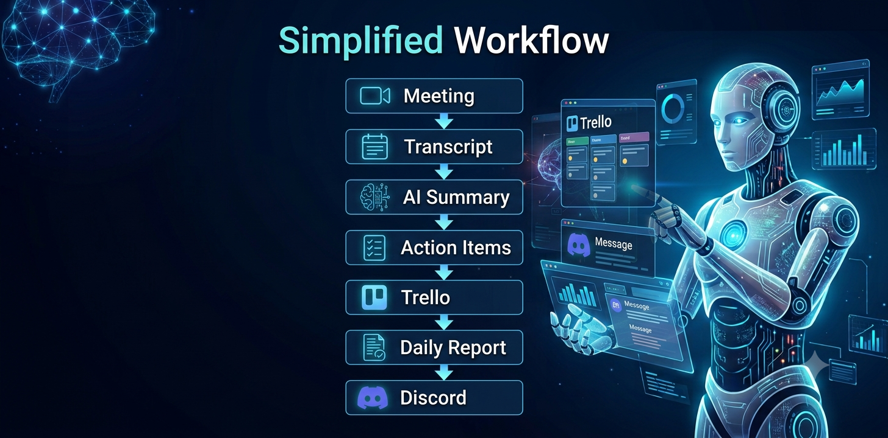

<div align="center">

# 🤖 OpenClaw AI Meeting Assistant



### 🚀 AI-Powered Meeting Automation using OpenClaw, Discord & Trello

Automatically summarize meetings, extract action items, create Trello cards, and deliver executive reports to Discord.


</div>

---

# 📖 Overview

This project was developed as part of the **GIAIC OpenClaw Assignment**.

The AI assistant can automatically:

- 🎤 Read Meeting Transcripts
- 📝 Generate Meeting Summaries
- ✅ Extract Action Items
- 📅 Detect Deadlines
- 📋 Create Trello Cards
- 🤖 Reply in Discord
- ⏰ Execute Scheduled Cron Jobs
- 🌅 Generate Morning Reports
- 🌙 Generate Evening Reports

---

# ✨ Features

| Feature | Status |
|----------|--------|
| OpenClaw Setup | ✅ |
| Discord Bot | ✅ |
| OpenRouter Integration | ✅ |
| Meeting Summary | ✅ |
| Action Item Extraction | ✅ |
| Trello Automation | ✅ |
| Cron Jobs | ✅ |
| Morning Report | ✅ |
| Evening Report Prompt | ✅ |

---

# 🏗 System Architecture

<p align="center">



</p>

---

# 🔄 Workflow

<p align="center">



</p>

---

# 📂 Project Structure

```text
OpenClaw-GIAIC-Assignment/

│
├── assets/
│   ├── banner.png
│   ├── architecture.png
│   └── workflow.png
│
├── docs/
│   ├── setup-guide.md
│   ├── architecture.md
│   ├── troubleshooting.md
│   ├── milestone-1.md
│   ├── milestone-2.md
│   ├── milestone-3.md
│   └── milestone-4.md
│
├── examples/
│   ├── sample-meeting.md
│   ├── sample-discord-output.md
│   ├── sample-morning-report.md
│   ├── sample-evening-report.md
│   └── sample-trello-cards.md
│
├── meeting/
│   ├── transcript.txt
│   ├── summary.md
│   └── action-items.md
│
├── prompts/
│   ├── meeting-summary.md
│   ├── trello-automation.md
│   ├── morning-report.md
│   └── evening-report.md
│
├── screenshots/
│   ├── dashboard.png
│   ├── discord-chat.png
│   ├── trello-board.png
│   └── cron-job.png
│
├── CHANGELOG.md
├── CONTRIBUTING.md
├── LICENSE
├── SUBMISSION.md
└── README.md
```

---

# 📷 Screenshots

## 🖥 OpenClaw Dashboard


---

## 💬 Discord Bot


---

## 📋 Trello Automation


---

## ⏰ Cron Jobs


---

# ⚙ Technologies Used

- OpenClaw
- OpenRouter
- Discord Bot API
- Trello REST API
- jq
- curl
- PowerShell
- Windows 11

---

# 🚀 Workflow

```text
Google Meet

        │

Meeting Transcript

        │

OpenClaw

        │

OpenRouter

        │

Meeting Summary

        │

Action Items

   ┌──────────────┐
   │              │
   ▼              ▼

Discord       Trello

        │

Morning Reports

        │

Cron Jobs
```

---

# 📚 Documentation

| Document | Description |
|----------|-------------|
| Setup Guide | Installation Process |
| Architecture | System Design |
| Troubleshooting | Common Issues |
| Milestones | Assignment Progress |

---

# 🏆 Milestones

- ✅ Milestone 1 — OpenClaw Installation
- ✅ Milestone 2 — Meeting Intelligence
- ✅ Milestone 3 — Trello Automation
- 🚧 Milestone 4 — Executive Assistant

---

# 🔮 Future Improvements

- Google Calendar Integration
- Google Meet API
- Slack Integration
- WhatsApp Notifications
- Email Reports
- Multi-language Support
- Voice Commands

---

# 👨‍💻 Author

**Syed Abdullah Zaidi**

- Full Stack Developer
- AI Enthusiast
- GIAIC Student

GitHub

https://github.com/syedabdullahzaidi786

---

# 📄 License

This project is licensed under the MIT License.

---

<div align="center">

### ⭐ If you like this project, consider giving it a Star.

Made with ❤️ using OpenClaw

</div>